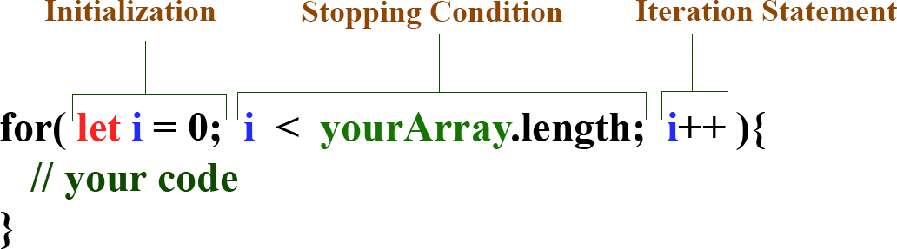

## JavaScript Intro - Loops

### Objectives
* Understand why loops are a fundamental concept in programming
* Understand what the difference is between a `for` loop, a `while` loop and a `do...while` loop
* Understand what nested a `for` loop is
* Learn about ways to escape a loop

---

## Loops In Programming

One thing that computers are good at doing is repetitive tasks quickly and perfectly. As developers, we can type as many lines of code that we want, but we are also the ones who are going to have to read it later or pass down the program to another developer. We strive to write as little code possible to accomplish as much as possible. We do this for sake of clarity and maintainability. So what does this have to do with loops? Well, loops allow us to tell the computer to repeat a set of instructions a certain number of times so that we don't have to explicitly write out the same code multiple times.

If I had a program that was meant to take a list of names and print a greeting for each of them (think automated emails - `Greetings Insert-Name-Here`), I could manually write out each greeting in code like this: 

```js
const customers = ["John Doe", "Sally Sal", "Mally Mal", "Theodore Cumberbatch", "Curtis Jackson", "Clark Kent", "Peter Parker", "Pegasus Walters"];

console.log(`Greetings ${customers[0]}`);
console.log(`Greetings ${customers[1]}`);
console.log(`Greetings ${customers[2]}`);
console.log(`Greetings ${customers[3]}`);
console.log(`Greetings ${customers[4]}`);
console.log(`Greetings ${customers[5]}`);
// ... etc.
```
Or, I could use a fundamental mechanism in programming known as a `loop`.

### The `for` Loop (15 minutes)
The `for` loop uses what's called an `iterator` variable and 3 `expressions` to operate. Those 3 expressions are:

1. An initialization expression
2. A stopping condition
3. An iteration statement

---



---

>**Note**: Iteration is just a fancy word for repetition or repeating. In our context it's the repetition of a process. An iterator keeps track of how many times the process has repeated.

```js
for(let i = 0; i < customers.length; i++){
  console.log(`Greetings ${customers[i]}`);
}
// This will output for every customer in our customers array (from above)
```

>**Note:** `i` is a conventional name for an iterator variable. It can be anything, of course, but you can think of the `i` in index as a reminder that you're using the variable to target the indices of an array or string.
>**Note:** you can iterate through an array in reverse by initializing the iterator variable to equal the length minus one, and then using the `decrement` operator in the iteration statement like so: `i--`.

Lets break this down a bit:
  - We declare an iterator, `i` with `let` within the initialization portion of the loop.
    - Using `let` gives our variable the flexibility to change
    - We've set `i` to equal `0` because we are thinking about targetting elements in our array via their `index` using `bracket notation`
    - We've set our stopping condition, and for us that means stop the loop when `i` is NO LONGER LESS THAN (`<`) `customers.length`
    - `customers` is our array, and `.length` gives us the amount of elements in that array (we get a `number` value here)
    - Our last expression is an iteration statement, which is telling our loop to add one (`++`) to `i` after every loop

The order of operations for these `expressions` happen like this:
1. First, the `initialization` happens where an `iterator` variable (`i`) is created.
2. Then the `stopping condition` is evaluted. If it evaluates to `true`, then we run the code that's in between the curly braces, and if `false` we end the loop and don't run the code in the curly braces.
3. After the code is executed, if we haven't forced our way out of the `for` loops, our iteration statement kicks in (in our case we are adding 1 to our iterator variable using the `increment operator` denoted with `++`).
4. We repeat steps `2` through `4` until our `stopping condition` evaluates to false, or we force our way out of the `for` loop with a `return` or `break` statement (more on that later).

Notice how we are using a template literal in this example (a string with backticks and `${}` for embedded expressions), where we are writing in an expression using our customers array and `bracket notation` in order to access each customer from the array. `i` is incrementing by one each loop, allowing us to access each customer in succession up until `i` is no longer less than the customers array (because of our `stopping condition`). Remember, because arrays are zero indexed, the first customer is located at the zeroth index.

## Time to Practice! (10 minutes)
Given the following array...

```js
const arrayOfNums = [5, 3, 2, 1, 0, 9, 10, 30, 55];
```

`console.log` all of the numbers.
`console.log` all of the even numbers.

### The `while` and `do while` Loops
- Generally, you want to avoid `while` loops and use for-loops when possible
- `do while` loops are similar to `Symbol` - both are rarely utilized

The `while` loops keeps repeating code until a specifed condition evaluates to false. Just like the `for` loop has a `stopping condition`, the `while` loop has one of it's own.

```js
while(/* stopping condtion */){
  // code
}
```

One thing to be aware of with `while` loops is that you can very easily create an infinite loop by accident. The `stopping condition` (expression) should at some point evaluate to `false` so that the loop stops - of course you can always force your way out of the loop. The browser will probably crash if you trigger an infinite loop.

The `do...while` loop ensures that the code within the body of the loop will execute at least once, before the `stopping condition` is evaluated.

```js
do {
  // code
} while (/* stopping condtion */)
```

### Continue, Break & Return (5 minutes)

You can use the keyword `break` to explicity stop and jump out of a loop:

```js
  const holdValues = [2, 3, 4, 10, 29, 39, 32, 20, 5];
  let i = 0;

  while(true){
    if(holdValues[i] === 5){
      console.log("We Found the 5!");
      break;
    } else {
      i++
      console.log("Still searching...");
    }
  }

  console.log("Phew, you must have found 5!");
```

The above example is a bad piece of code for a number of reasons, a couple of them being that it doesn't account for the possibility that there might not be a `5` in the array and our `stopping condition` is always `true`! If there is no `5` then this loop will run until the browser crashes. This example does, however, demonstrate that you can use the `break` statement to cancel and jump out of a loop. 

You can use `continue` to explicity stop the rest of the code in a loop from running and skip to the next iteration.

```js
let favoriteNumbers = '';

for(let i = 0; i < 10; i++){
  if(i === 3 || i === 5 || i === 9){
    continue;
  }
  favoriteNumbers += i;
}

console.log(favoriteNumbers);
// Output: "0124678"
```

The `return` keyword we'll have to come back to and spend more time with because it's used with `functions`, but it's worth repeating that when this keyword is ran inside a loop, that loop ends.

### A Note On Choosing A Loop (5 minutes)

There is a choice to be made when it comes to finding the best loop for the job. Often it's as simple as whether or not you know how many times you are going to iterate (loop) through a data structure (data). If you do know, stick with a `for` loop and if you don't use a `while` or a `do...while` loop. You can use an analogy of eating to understand when to use a `while` loop: you don't know how many bites it'll take till you're full. Ultimately, both you'll be using mostly `for` and `while` loops, and both can do what the other can - it's just about choosing the one that makes the most sense for the situation.


---

## Nested Loops (10 minutes)

While usually considered inefficient, there are times when you might need to use a nested loop to solve a problem. For instance, how would you compare whether one array has elements that exist in another? You can definitely use a nested `for` loop for this:

```js
  const myShoppingList = ["Apples", "Bread", "Cheese", "Grapes", "Sauerkraut", "Cucumber"];
  const myFridge = ["Tartar Sauce", "Pickles", "Sauerkraut", "Milk", "Cheese"];
  const iAlreadyHave = [];

  for(let i = 0; i < myShoppingList.length; i++){
    for(let j = 0; j < myFridge.length; j++){
      if(myShoppingList[i] === myFridge[j]){
        iAlreadyHave.push(myShoppingList[i]);
      }
    }
  }

  console.log(iAlreadyHave);
  // Output: ["Cheese", "Sauerkraut"]
```
Some things to note:
- What this nested loop is doing is starting with `Apples` from `myShoppingList` and checking against each item in `myFridge` and seeing whether there is a match. If there is a match it gets `pushed` (added) to the array `iAlreadyHave`. When all items in `myFridge` are checked against `Apples`, the next item in `myShoppingList` is selected and the process of checking against each item in `myFridge` is repeated.
- When nesting loops, it's often common to see iterator variables named as a succession of the alphabet starting from `i`: `i, j, k` etc.


### Time To Practice! (15 minutes)

Given the following string and using a loop...

```js
const famousQuote = "Your time is limited, so don't waste it living someone else's life. Don't be trapped by dogma – which is living with the results of other people's thinking."
```

`console.log()` all of the vowels.
console.log all vowels and store the amount of vowels in a variable called vowelCount after log the vowelCount.