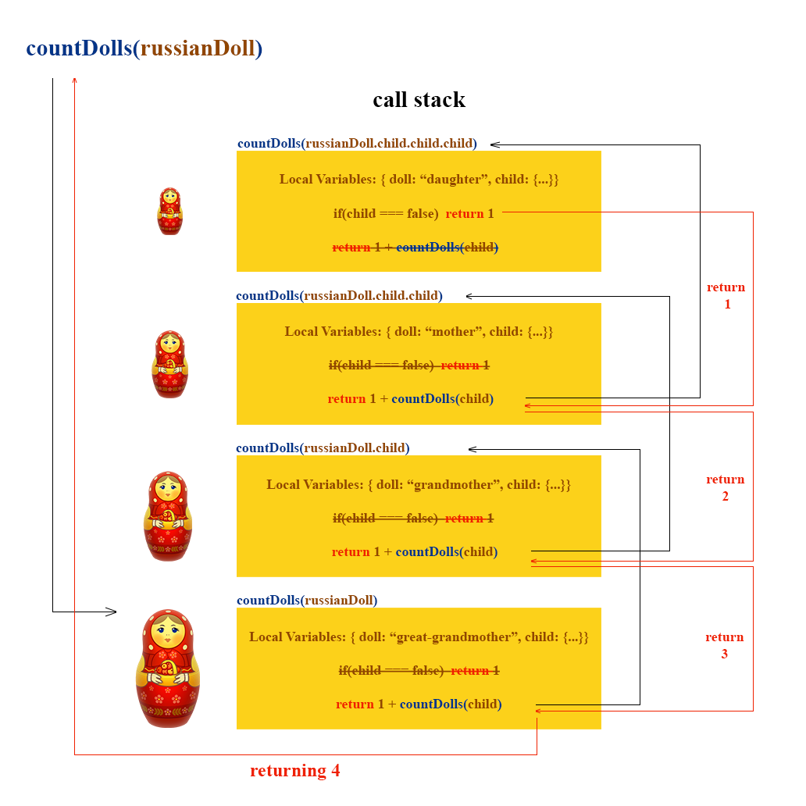
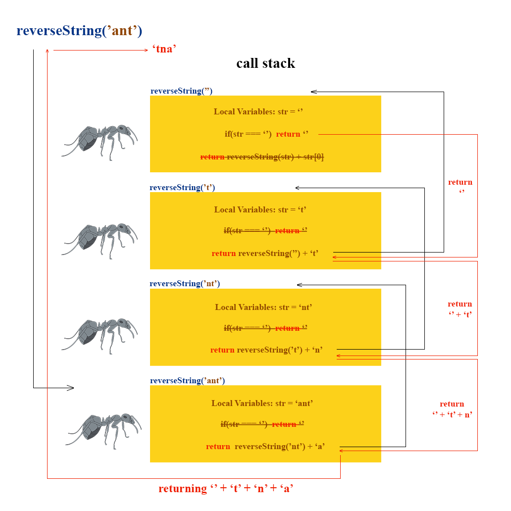

## JavaScript Intro - Recursion

### Objectives


### What Is Recursion?
Recursion is the process by which a function will call itself, usually multiple times, until a problem is solved.


If this sounds similar to what a `loop` might accomplish, you're spot on - more specifically a `while loop`. Before talking about the specifics of recursion in code, lets first look at an example of what a recursive function might look outside of programming to help us understand the concept a little better. 

A classic metaphor for recursion would be the Russian Nesting Dolls.


From one doll you get many, and each is nested within the other. Lets say we wanted to figure out how many layers exist within a Russian Doll, how might we go about doing this? Well, we could count them. We would look at the outer doll and start at 1. If there was doll inside we would count 2. If there was another doll inside the 2nd one we would count 3, and so on until we found a doll without a child.

How might this look in code?

```js
const russianDoll = {
    doll: "Great Grandmother",
    child: {
        doll: "Grandmother",
        child: {
            doll: "Mother",
            child: {
                doll: "Daughter",
                child: false
            }
        }
    }
}

const countDolls = (doll) => {
    if(!doll.child){
        return 1;
    }
    return 1 + countDolls(doll.child);
}

countDolls(russianDoll); // Returns 4.

```

There are two main pieces to a recursive function:
    1. The **base case**
    2. The **recursive case**

A recursive function is usually set up to first check a **base case**, which for our `countDolls` function is `if(!doll.child) return 1`. This translates to "if the current doll we are considering, doesn't have a child, return 1". We want to establish the base case as early as possible in order to define a stopping point - i.e. if there is ever a doll without a child than we know we've found the last doll and can stop counting. A base case is super important because without it, a recursive function will keep calling itself until your browser crashes or returns some kind of **stack overflow** error.

The **recursive case** defines where the function performs some action and returns itself. So in the example above, the function is counting the current doll by returning `1` plus whatever`countDolls` evaluates to when the child of the current doll is passed as an argument. The thing is, because `countDolls(doll.child)` needs to be evaluated before the `return` statement finishes, it'll be waiting until `countDolls(doll.child)` finishes executing and provides value. This will keep happening until the **base case** returns `1` and stops the recursion - this will essentially look like `1 + 1 + 1 + 1`, with the last `1` being what was returned after the **base case** condition was met.

### The Call Stack
Recursion can be tough to wrap your brain around without a visual. To understand a little bit about how recursion works, we have to have a basic understanding of how the `Call Stack` works in JavaScript. A `stack` is a data structure that you can kind of compare to an array where functions get pushed to (added) and popped from (removed from) the end of a sequence. Everytime a function is called in the `global scope` it creates an "execution context" or frame, which gets pushed onto the call stack and ran. Frames can literally stack on top of each other if the one below it hasn't finished. Only one frame can be executed at a time because JavaScript is single threaded. So when a function calls another function, whether it be itself or any other, that new function needs to be evaluated before the previous function can finish. The stacking of frames and recursion go hand in hand - below is an example of our `countDolls` function in action and how the call stack is affected.



The bottom frame is the first to get pushed to the call stack, and as `countDolls` gets called recursively, more frames or "exection contexts" get stacked up. As soon as a function returns a value, that frame gets removed, or popped from the call stack and the other function below it gets to continue to run. This is called `unwinding of the call stack`.

---

## Classic Recursive Examples

There are a few classic examples of recursion that you'll likely come across. Lets focus on two:
1. Use recursion to reverse a string.
2. Detect whether a string is a palindrome using recursion.

### Reverse A String
For this problem we'll want to take a string like `ant` and return the reversed version of it: `tna`. We are using a short word to keep things simple.

Before we start stressing about the code that's involved, we want to visualize how we might solve something like this. If you had tiles in front of you, spelling out `tna` where each tile had a single character on it, what are somethings you could physically do to get this figured out? One of them might be to put your finger on the last character, `t`, and drag it away from the rest of it's friends. Then you might proceed to drag the `n` and put it in front of the `t` away from it's buddy. You could continue to follow this pattern working your way to the first letter `a`. In code, you could do this easily with a `for` loop, but lets get fancy for a minute and check out how we might do something similar using `recursion`.

```js
function reverseString(str){
    if(str === '') {
        return '';
    } else {
        return reverseString(str.slice(1)) + str[0];
    }
}

reverseString('ant'); // Returns 'stna'
```

In this recursive function we are using both our understanding of how we build up and `unwind` the call stack, along with our tile solution.

Lets talk about the code. Our `if` statement works as our `base case` - whenever our input `string` is empty, we return an empty `string` right back. For our **recursive case** we are using the `string` method `.slice()` to carve out a `sub-string` from our input, starting from index 1 - this means we are losing the first character and keeping the rest. So, for our first stop in our recursion we are passing in `nt` into our function `reverseString()` in the return statement and adding the first character `a` to what comes back. In order to figure out what comes back, we need to start our function over, check our base case, cut our string again and repeat this process until we no longer have any characters, and that's when we'll hit the `base case` (an empty string). As soon as we do, we begin `unwinding` the call stack and fulfilling the return statement of every call to `reverseString()` that we made along the way, except in a reverse sequence starting from the last call.



### Palindrome

Another classic `recursive` solution to study is the writing of a function that checks whether a `string` is a palindrome. A palindrome is a word that reads the same when it's characters are reversed. The word **racecar** is an example of a palindrome, because when spelled backwards you get the same word. 

Again, before we start worrying about the code, we want to think more conceptually about an approach. Lets think back to our tiles - we have a set of tiles with one character on each, spelling out **racecar** in front of us. Now, at this point you might realize there are a bunch of different ways we can determine whether we are looking a palindrome, and that's great. For now, lets imagine we take the approach of putting our left index finger on the first character, and our right index finger on the last character and moving the two characters up. Lets compare them. If they are the same, lets discard them and repeat what we just did with the next couple of letters. If at any point those two characters aren't the same, we know we aren't dealing with a palindrome.

With that in mind, lets establish a **base case** for this solution. If we get down to one letter, or if the user passes in one letter to our function we want to return `true`, because one character is considered a palindrome, and if we've gotten that far while we were stripping away the outer characters, we know that the one remaining is actually the middle of our word and will remain the middle even when it's reversed. We'll say that an empty string is also a palindrome. So with the **base case** in mind, and our **recursive case** conceptually established, lets check out the code.

```js
function isPalindrome(str){
    const len = str.length;
    if(len <= 1) return true;
    if(str[0] !== str[len-1]) return false;
    return isPalindrome(str.slice(1, len-1));
}
```

To be clear, the above code doesn't handle a few edge cases, which is important note. One of those edge cases has to do with the question of what happens if our input string starts with an uppercase character. Even if the string is a palindrome our function won't catch that because it'll compare an uppercase letter to a lowercase and return false because they aren't equivalent. We will leave this and other edge cases alone for now and just assume that the string doesn't have any special characters in it - only lowercase letters.

It's also fair to mention that the syntax might look a little strange in particular because we are ommitting the `{}` from our `if` statements. You can actually do this if the statement body can fit on one line.


The first thing that we are doing is putting the length of our input string in a variable - this is optional. Next up is our **base case**, which is if the `.length` of the incoming string is less than or equal to 1 we can hop out of the function and return `true`. In the following line we are checking to see whether the character at the beginning of our string, is the same as the one at the end. This check goes back to our tile solution from earlier. If they aren't the same, we end our recursive journey and return `false`. The last line is where the recursion begins and if we've passed both if statements that means we need to put the next set of characters at the front and end of our string through the same checks. Again, what this will be doing is adding frames to the call stack that are waiting for an evaluation. As soon as there is a solid return of `true` or `false` the frames will each be `popped` off the stack until the final `isPalindrome` call evalutes to either `true` or `false`.

### Time To Practice!

Another problem that is classically solved with recursion, is writing a function that takes a number as an input and outputs it's factorial.

As a reminder, a factorial denoted by `n!` is the product of an integer and all the integers below it. So `4!` denotes the factorial of `4`, which is `24`. You would come to this solution by doing `4 * 3 * 2 * 1 = 24`.

Using our new found understanding of `recursion` define a recursive function that will return the factorial of an input number.

>**Reminder / FYI:** A lot of recursive code solutions can be solved with a loop / while loop. Writing a recursive solution is usually easier to read and is seen as an "elegant" approach. However, in JavaScript, recursion tends to be more costly on your machine than just using loops in part because recursion uses the entire the Call Stack instead of just one frame on the Call Stack like a loop.